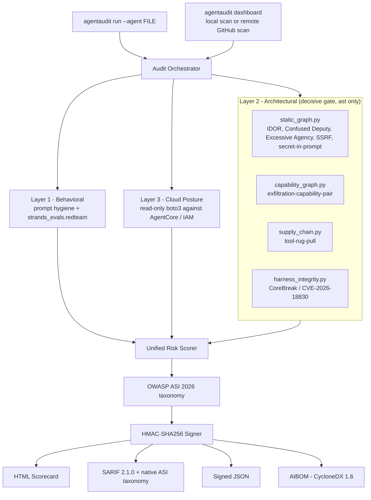

# AgentAudit

[](https://github.com/TOUMO45/AgentAudit/actions/workflows/ci.yml)


**The missing security layer for Strands agents.**

> *Your agent passed the demo. Did it pass the pentest?*

### 🔴 [**Live judge demo — no install needed**](https://toumo45.github.io/AgentAudit/)

A static site with real, freshly-rendered scorecards (vulnerable → `GRADE F`,
hardened → `GRADE A`, a live CVE-2026-18830 demo), a real AI Bill of Materials,
and the exact commands to run it yourself. GitHub Pages can't run Python, so
this is a snapshot of real output — everything in it links back to code you can
run locally in under two minutes (see [**Test it in 5 minutes**](#test-it-in-5-minutes) below).

---

AgentAudit runs **four independent layers** of adversarial testing against a
[Strands](https://strandsagents.com) agent — **static tool-trust boundaries**,
**the agent harness itself**, **model behavior**, and **AWS/AgentCore
deployment posture** — and produces **one signed scorecard**, mapped to the
**OWASP Top 10 for Agentic Applications (2026)**, with a concrete, diff-ready
fix for every finding.

It exists because the tooling gap is real. AWS ships
`strands_evals.experimental.redteam`, but it tests *model behavior only*.
Generic SAST scanners (agent-boundary-scan, Inkog, mcp-sec-scan) are
framework-agnostic and don't understand AgentCore. Nobody was checking the
**tool/permission layer** — the exact root cause behind the 2025–2026 MCP
incidents (Cisco found a vulnerability in 26% of 31,000 agent skills;
Smithery.ai path-traversal exposed 3,000+ servers; ClawHavoc / CVE-2026-25253
compromised 1,000+ packages) — or the **harness's own event loop**, which is
exactly where CoreBreak (CVE-2026-18830) lives. AgentAudit unifies all four,
Strands-native.

---

## What makes this more than a wrapper

| | |
|---|---|
| 🔍 **The decisive gate: a static tool-trust graph** | Parses the agent with the stdlib `ast` — no LLM, no execution — and flags IDOR-in-Agent, Confused Deputy, Excessive Agency, SSRF, secret-in-prompt, and dangerous *combinations* of tool capabilities. Nothing else does this for Strands. |
| 🛡️ **A live, unpatched CVE in the harness itself** | Detects **CoreBreak (CVE-2026-18830)** — a real Black Hat 2026 disclosure. AWS patched the managed AgentCore API but not the open-source Strands SDK; AgentAudit checks whether *your* agent code guards against it. |
| 🌐 **Scan any public GitHub repo, live** | The dashboard shallow-clones a public repo (read-only, sandboxed, single-flight, time-boxed) and runs the real static detectors against it — in front of you, in seconds. |
| 📋 **Mapped to OWASP ASI 2026** | Every finding carries an `ASIxx` tag — in the HTML scorecard, natively in the SARIF taxonomy, and in the CLI — from the OWASP Top 10 for Agentic Applications, published Dec 2025. |
| 📦 **A real AI Bill of Materials** | A 4th signed artifact per run: a valid **CycloneDX 1.6** BOM listing every tool, its capability class, dependencies, the model (if statically known), MCP servers, and exfiltration-capable tool pairs. |
| 🔧 **Auto-generated remediation, not just warnings** | A dangerous capability pair doesn't just get flagged — AgentAudit emits a schema-valid **AgentCore Cedar policy** that denies the exact egress leg. |
| ✅ **Verified against real, independent code** | Hand-verified true positives (file + line + commit, not self-reported) in public Apache/MIT-licensed Strands repos — see [Real-world validation](#real-world-validation) below. |
| 🖥️ **A live console, backed entirely by real scans** | `agentaudit dashboard` — stdlib `http.server`, zero extra dependencies, every number on it traces back to a real audit; empty states say so honestly instead of showing mock data. |

---

## Project status

Full breakdown in **[STATUS.md](STATUS.md)**. In short:

- **Live-verified** (real command / API output on file): all 8 charter success
  conditions, including a live AgentCore posture check against a real deployed
  runtime ([`references/live_cloud_posture_verified.md`](references/live_cloud_posture_verified.md));
  org-wide discovery + scan across every AgentCore runtime in the account
  ([`references/live_org_wide_scan_verified.md`](references/live_org_wide_scan_verified.md));
  and two rounds of Layer-2 static analysis against public Strands repos we
  didn't write, with **4 hand-verified true positives** (plus one borderline
  finding and two detector-precision/coverage gaps, logged with reasoning
  rather than hidden) and **2 confirmed-clean controls**
  ([`references/real_world_findings.md`](references/real_world_findings.md)).
- **Code-complete but not live-verified** (a time-boxed scoping call, not a
  technical failure): Cedar policy auto-remediation deployed to a live
  AgentCore Gateway, AgentCore Evaluations integration, the observability fix,
  and an AgentCore Identity / Consent-Portal posture check (researched in
  full — feature, API surface, exact IAM delta — but descoped before the
  deadline). Each is either built + unit-tested, or fully researched with the
  reasoning on record.

**213 tests** (211 pass, 2 intentionally skipped); `./guard.sh check` →
`INTEGRITY OK` (37 fixture/detector paths hash-frozen); CI green on a clean
Linux / Python 3.11 checkout.

---

## Test it in 5 minutes

No AWS account needed for any of this — the static detectors (the decisive
gate) run on pure Python.

```bash
# 1. clone & install
git clone https://github.com/TOUMO45/AgentAudit.git && cd AgentAudit
python -m venv .venv && . .venv/Scripts/activate   # Windows: .venv\Scripts\Activate.ps1
pip install -r requirements.txt && pip install -e .

# 2. the before/after that tells the whole story
agentaudit run --agent fixtures/vulnerable_agent.py   # GRADE F, 7 findings, exits 1
agentaudit run --agent fixtures/hardened_agent.py     # GRADE A, 0 findings, exits 0

# 3. a real, currently-open CVE in the harness itself
agentaudit run --agent fixtures/corebreak_vulnerable.py   # CVE-2026-18830 (CoreBreak)

# 4. inspect every artifact from one run
ls out/   # scorecard.html · report.sarif · report.signed.json · aibom.json

# 5. the live console — try "scan a public GitHub repo" yourself
agentaudit dashboard   # opens http://127.0.0.1:8770 — paste any owner/repo
```

1. **No install path:** every command above also works as
   `python -m agentaudit <cmd>` from the repo root — no venv, no PATH setup.
2. **Prove it isn't gamed:** run `pytest` (213 tests) and `./guard.sh check`
   (→ `INTEGRITY OK`) — the fixtures and every detector module are
   hash-frozen, so a tampered fixture or detector is caught with its exact
   diff, not silently accepted.
3. **Try the live remote scan:** in the dashboard, next to "one agent", paste
   `strands-agents/agent-builder` (or any public `owner/repo`) into
   *"or scan a public GitHub repo"* — it shallow-clones and statically scans
   it, read-only, in front of you.
4. **See it without installing anything:** the
   [live judge demo](https://toumo45.github.io/AgentAudit/) has the same three
   scorecards, a real AIBOM, and the architecture diagram, pre-rendered.

> **`agentaudit : the term 'agentaudit' is not recognized…`** — you're in a
> shell where the package's `Scripts/` dir isn't on `PATH` (venv not
> activated, or you installed into a different interpreter). Either
> re-activate the venv, run `python -m pip install -e .` in the interpreter
> you're actually using, or just use `python -m agentaudit …` everywhere.

## One-command run

```bash
agentaudit run --agent fixtures/vulnerable_agent.py
# or, with no install:  python -m agentaudit run --agent fixtures/vulnerable_agent.py
```

You'll get a terminal summary plus **four artifacts** in `out/`, all from one
invocation:

| File | Purpose |
|------|---------|
| `scorecard.html` | shareable dark security-dashboard scorecard; each finding carries an **OWASP ASI 2026** chip |
| `report.sarif`   | SARIF 2.1.0 — drops straight into GitHub Code Scanning; **native** `OWASP-ASI-2026` taxonomy (real `taxonomies`/`relationships`, not a text label) |
| `report.signed.json` | HMAC-signed, tamper-evident; the CI gate reads this |
| `aibom.json` | **AI Bill of Materials** — a valid CycloneDX 1.6 BOM: tools + capabilities, model, dependencies, MCP servers, capability pairs |

The process exits **non-zero** when findings meet the `--fail-on` threshold
(default `medium`), so it works as a CI gate out of the box.

### The before/after that tells the whole story

```bash
agentaudit run --agent fixtures/vulnerable_agent.py   # GRADE F, exits 1
agentaudit run --agent fixtures/hardened_agent.py     # GRADE A, exits 0
```

Same agent family; the second one has every planted flaw fixed. A security
tool you can trust must be able to *pass*, not only fail.

## What it detects

**Layer 2 — Static Tool Trust Graph (the decisive gate).** Parses your agent
with the stdlib `ast`, builds a tool-trust graph, and flags patterns straight
from web-app penetration testing, mapped onto agents. Never executes anything
it parses — including a repo fetched live from GitHub.

- **IDOR-in-Agent** — a tool trusts a caller-supplied `account_id`/`document_id`
  and reads a shared store with no ownership check. → `ASI03`
- **Confused Deputy** — an untrusted parameter is forwarded, unvalidated, into
  a privileged sink. → `ASI02`
- **Excessive Agency** — a "read-only" tool that shells out / deletes / writes. → `ASI02`
- **SSRF-via-tool-param** — a `url`/`endpoint` parameter reaches an HTTP call
  with no allowlist. → `ASI02`
- **Secret-in-system-prompt** — an API key / high-entropy token embedded in
  the prompt. → `ASI03`
- **Tool rug-pull** — a trusted tool's `.tool_spec` silently changes between
  scans (supply-chain / tool-poisoning). → `ASI04`
- **Exfiltration capability pair** — no single tool is dangerous, but the tool
  *set* combines write / read-secret / read-data with network egress. This is
  the finding [Cedar auto-remediation](agentaudit/remediation/cedar.py) is
  generated from. → `ASI02`
- **`harness-model-skip-corebreak`** (new) — checks whether *your* code guards
  against **CoreBreak / CVE-2026-18830**: caller-supplied conversation history
  reaching the Strands event loop with no `toolUse` sanitization, which lets an
  attacker skip the model entirely. Detection only — no exploit code, and the
  finding never overclaims what it found. → `ASI01` + `ASI05`. See
  [`references/corebreak_detector_basis.md`](references/corebreak_detector_basis.md)
  for the real upstream source excerpt and CVE references.

**Layer 1 — Behavioral.** Static system-prompt hygiene (over-broad authority,
missing refusal guidance → `ASI01`) plus a wrapper around AWS's own
`strands_evals.redteam` that auto-generates adversarial cases from *your
agent's actual tool list* on top of the five built-in risk categories.

**Layer 3 — Cloud Posture.** IAM least-privilege, Bedrock Guardrails
attached-and-active, AgentCore Memory encryption/TTL, runtime network mode, and
IMDSv2 enforcement — offline against a `<agent>.deploy.json` descriptor, or
live via **read-only** boto3 (`List*`/`Get*` only, never a mutating call).

**Every finding, everywhere, is mapped to the [OWASP Top 10 for Agentic
Applications (2026)](references/asi_2026_mapping.md)** — 12 of 14 rule_ids
mapped, with the 2 that don't cleanly fit an ASI category **explicitly left
unmapped** rather than forced (a cross-cutting mitigation and an
infrastructure-posture finding — see the mapping doc for why).

## Real-world validation

Run against public Strands repos we didn't write, hand-verified against the
real source at the flagged line (file + line + commit — not self-reported).
Full log: [`references/real_world_findings.md`](references/real_world_findings.md).

| Repo | License | Result |
|---|---|---|
| [`kyopark2014/strands-agent`](https://github.com/kyopark2014/strands-agent) | Apache-2.0 | **3 TRUE POSITIVES** — unrestricted RCE via `exec` and `bash` tools, plus a write→S3→public-URL exfiltration pair |
| [`cagataycali/strands-fun-tools`](https://github.com/cagataycali/strands-fun-tools) | Apache-2.0 | **TRUE POSITIVE** — confused deputy: an untrusted `collection_id` reaches `rekognition.delete_faces(...)` behind only a presence check |
| [`strands-agents/agent-builder`](https://github.com/strands-agents/agent-builder) (official) | Apache-2.0 | **0 findings — confirmed clean** |
| [`eraykeskinmac/strands-hubspot`](https://github.com/eraykeskinmac/strands-hubspot) | MIT | **0 findings — confirmed clean** (genuinely read-only tool) |

One detector-precision gap was also found and root-caused rather than hidden
(a char-allowlist guard the confused-deputy detector doesn't yet recognize),
and one coverage gap was surfaced and deferred (a legacy pre-`@tool` Strands
tool form) — both logged with reasoning in the same file.

## AWS services this project uses or targets

| Service | Used for |
|---|---|
| **Amazon Bedrock AgentCore Runtime** | Live posture check against a real deployed runtime — network mode, IMDSv2, workload identity |
| **Amazon Bedrock AgentCore Identity** | Workload-identity posture; Consent-Portal check researched for future work |
| **Amazon Bedrock AgentCore Gateway / Policy Engine** | Target of generated, schema-valid Cedar policies that auto-remediate exfiltration capability pairs |
| **Amazon Bedrock AgentCore Memory** | Encryption-at-rest / TTL posture check |
| **Amazon Bedrock Guardrails** | Attached-and-active posture check |
| **Amazon Bedrock (model invocation)** | `bedrock:InvokeModel*` least-privilege check on the execution role |
| **AWS IAM** | Least-privilege analysis of the execution role, offline or live read-only |
| **Amazon ECR** | Container image for the deployed AgentCore runtime |
| **Amazon CloudWatch Logs** | Observability target for the unified-tracing future-work item |
| **Strands Agents SDK / `strands_evals`** (AWS open source) | The framework under test, and the red-team engine Layer 1 wraps |

Every live AWS call AgentAudit itself makes is `Get*`/`List*` — **read-only,
never a mutating call** (this is enforced by which IAM permissions the tool's
own credentials are ever granted, not just by convention).

## Usage

Both forms work everywhere — `agentaudit <cmd>` after `pip install -e .`, or
`python -m agentaudit <cmd>` with no install:

```bash
agentaudit run --agent path/to/agent.py \
    [--deploy-config agentcore.deploy.json] \   # else auto-discovered as <agent>.deploy.json
    [--out out/] [--no-dynamic] \
    [--live-role my-exec-role --region us-east-1] \
    [--fail-on {any,medium,high,critical}]

agentaudit verify --json out/report.signed.json   # prove a report wasn't tampered with
agentaudit dashboard [--port 8770] [--no-open]     # live web console over HTTP

# guaranteed fallback if `agentaudit` isn't on your PATH:
python -m agentaudit run --agent path/to/agent.py
python -m agentaudit dashboard
```

`agentaudit dashboard` prints its URL and auto-opens your browser to
`http://127.0.0.1:8770/` (`--no-open` to just print; it walks to the next free
port if 8770 is busy). It serves over HTTP — **never** open `ui.html` as a
`file://` path; the page shows a banner telling you so if you do. Every number
the dashboard shows comes from a real scan, and each section has an explicit
empty / unavailable state — it never renders mock data as if it were a real
result.

**Scan a public GitHub repo, live**, right from the dashboard: type or paste
`owner/repo` (or a full `https://github.com/...` URL, with an optional
`/tree/<branch-or-commit>`) into *"or scan a public GitHub repo"* and click
**Run full audit**. Under the hood
(`agentaudit/dashboard/remote_scan.py`): the URL is strictly validated
(GitHub-only, no SSRF-shaped hosts), the repo's size and license are checked
via the GitHub API, it's shallow-cloned (`--depth 1`) into an isolated,
single-flight, always-cleaned-up temp directory with a 60s clone / 30s scan
budget, and only the pure-`ast` detectors run against it — **the cloned code is
never imported or executed.**

Live IAM check demo (works with or without AWS credentials — stubbed mode is
clearly labeled):

```bash
python scripts/live_iam_check_demo.py
```

## Ground truth & the integrity guard

The `fixtures/` set and [`fixtures/MANIFEST.md`](fixtures/MANIFEST.md) are the
human-reviewed source of truth. After sign-off they are frozen and protected,
alongside every detector/scorer module:

```bash
./guard.sh freeze     # record trusted hashes of fixtures + detector/scorer code
./guard.sh check      # prove nothing changed behind the human's back (INTEGRITY OK)
```

If a check fails against a fixture, the rule is: **fix the detector, never the
fixture.** The trap logic (why each fixture can pass, not only fail) is in
[`references/trap-design.md`](references/trap-design.md).

## Testing

```bash
pytest
```

213 tests. The suite encodes the charter's success conditions directly: each
pattern class flagged on its positive with zero false positives on the
hardened control, the vulnerable→fail / hardened→clean / stub→zero gates, the
four-format output contract (HTML/SARIF/JSON/AIBOM validated against **both**
the official SARIF 2.1.0 and CycloneDX 1.6 schemas), the OWASP-ASI-2026
coverage gate (fails loudly if a future detector ships unmapped), and the
CoreBreak detector's zero-false-positive guarantee across the whole fixture
set.

## Architecture



Full diagram (including the remote-scan sandbox flow), the four architectural
detector modules explained, and the AWS services table:
[`docs/architecture.md`](docs/architecture.md).

## A note on live AWS

The cloud-posture layer's boto3 code path is real and read-only. Live checks
against a deployed AgentCore agent require AWS credentials with read-only IAM
permissions; without them, the layer degrades honestly (reported as `skipped`)
and the demo uses a **clearly labeled** stubbed IAM response that drives the
identical code path. Nothing is ever implied to be live when it is not.

## Future work

**a. Live Cedar policy enforcement via a real AgentCore Gateway.** The generator
(`agentaudit/remediation/cedar.py`) already emits schema-valid AgentCore Cedar
from a capability-pair finding, and `deploy.py` wraps the real `CreatePolicy`
API. The next step is standing up an AgentCore Gateway (needs an IAM role +
`iam:PassRole`), deploying a generated deny policy against a test runtime,
confirming `GetPolicy` reports `ACTIVE`, and demonstrating a blocked vs. allowed
tool call end-to-end. This turns AgentAudit from *report* to *enforced
remediation*.

**b. AgentCore Evaluations integration.** Run AWS's built-in evaluators
(`StartBatchEvaluation` / `GetBatchEvaluation`) alongside the custom
`strands_evals.redteam` scenarios in Layer 1, tagging each finding by origin
(`agentcore-evaluations` vs `custom-redteam`) so results carry AWS's own
framework's weight in addition to ours.

**c. Observability / unified tracing.** Resolve the two non-fatal
`logs:PutResourcePolicy` / `logs:PutDeliverySource` warnings seen at deploy by
adding the scoped `logs:` delivery permissions, setting
`UNIFIED_TRACES_DESTINATION_ENABLED=true`, and routing spans to the agent's own
CloudWatch log group.

**d. Layer 1 + Layer 2 as a bug-bounty methodology.** The behavioral layer
(adversarial cases generated from the target's real tool list) and the static
trust-graph layer (IDOR-in-agent, confused deputy, excessive agency, SSRF,
exfiltration capability pairs) are directly applicable to authorized bug-bounty
engagements on programs whose scope **explicitly covers AI / agent features** —
where the researcher can read the agent's tool definitions and system prompt.
Layer 3 (cloud posture) is **not** applicable to external black-box bounty work:
it requires the target's own read-only IAM/AgentCore access, so it only fits
direct enterprise engagements. No external target testing has been or will be
performed from this repo; this is a note on where the methodology transfers.

**e. AgentCore Identity / Consent-Portal posture check (`ASI03`).** Researched
against the real Sept-2026 managed Consent Portal launch and the installed
`bedrock-agentcore-control` service model (`GetConsentPortal` /
`GetWorkloadIdentity` / `ListOauth2CredentialProviders` / `GetTokenVault` all
present); implementation descoped for this submission because the fixture
deployment has no AgentCore Gateway (a consent portal attaches to one), so a
live run would return "not configured". The full research — feature, API
surface, and the exact read-only IAM delta needed — is in
[STATUS.md](STATUS.md#-sept-2026-enhancements-grounded-in-current-external-reality).

## License

Apache-2.0 — see [LICENSE](LICENSE).
