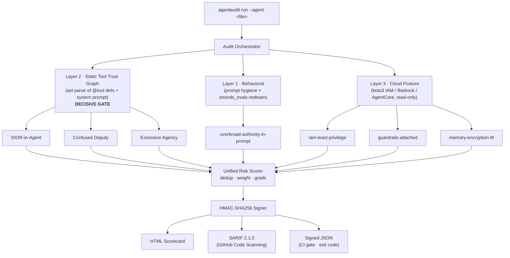

# AgentAudit — Architecture

One CLI invocation fans out to three independent layers, unifies their findings
in a deterministic scorer, signs the result, and renders it three ways.

## Data flow

1. **Orchestrator** (`agentaudit/audit.py`) runs deterministic layers first
   (charter rule 2). Each layer returns a `LayerReport` with an explicit
   `ran` / `skipped` / `error` status so a skipped layer is never silently
   dropped from the verdict.
2. Every layer emits `Finding` objects sharing one vocabulary
   (`agentaudit/models.py`): detector id, layer, severity, evidence, and a
   diff-ready `Remediation`.
3. The **scorer** (`agentaudit/scorer.py`) deduplicates by fingerprint, sums
   severity weights into a 0–100 risk score, and assigns a letter grade —
   deterministically, so a CI gate is reproducible.
4. The **signer** (`agentaudit/signing.py`) HMACs a canonical serialization so
   the JSON report is tamper-evident.
5. The **renderers** (`agentaudit/report/`) emit all three formats from the one
   scorecard.

## Why the layers are independent

Each layer answers a different question and fails independently:

| Layer | Question | Determinism |
|-------|----------|-------------|
| Architectural | Do the tool trust boundaries hold? | deterministic (`ast`) |
| Behavioral | Does the model resist adversarial pressure? | heuristic + LLM |
| Cloud | Is the deployment posture least-privilege? | deterministic (`boto3`) |

The architectural layer is the **decisive gate**: it is the capability no
existing Strands/AgentCore tool provides, and it runs fully offline and
deterministically.

## Trust anchors

The `fixtures/` ground truth and the detector/scorer code are frozen by
`guard.sh` after human sign-off (SHA-256 baseline). A tampered fixture or scorer
is detected with its exact path and diff before any audit is trusted.
